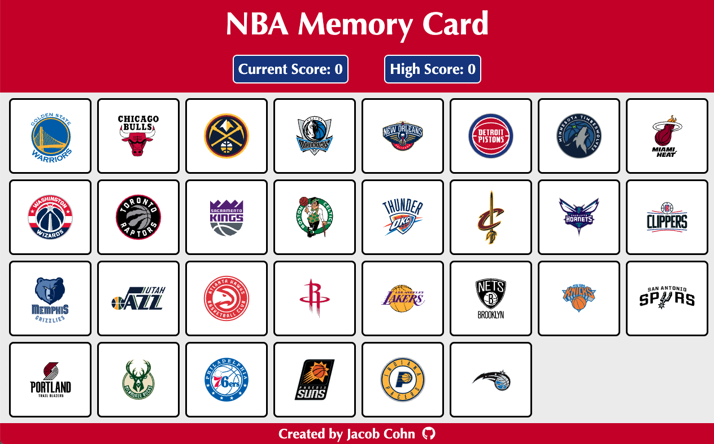

# NBA Memory Card

## Where To Play
> **Live Preview:** https://jacobcohn.github.io/memory-card/

You can play on a computer, tablet, or phone. Just open a browser and go to the link above.

## How To Play
The objective of the game is get the highest number of points. Every time you click on an NBA team, you get a point. Be careful though because if you click on the same team twice, you score restarts to 0. On top of that, the NBA teams shuffle each time you click on a team. Good luck!

## Technologies Used
- React
- React Icons
- React Testing Library
- Styled Components
- UUID

## Credit
NBA teams were used in the creation of this game. Thank you to the NBA!
