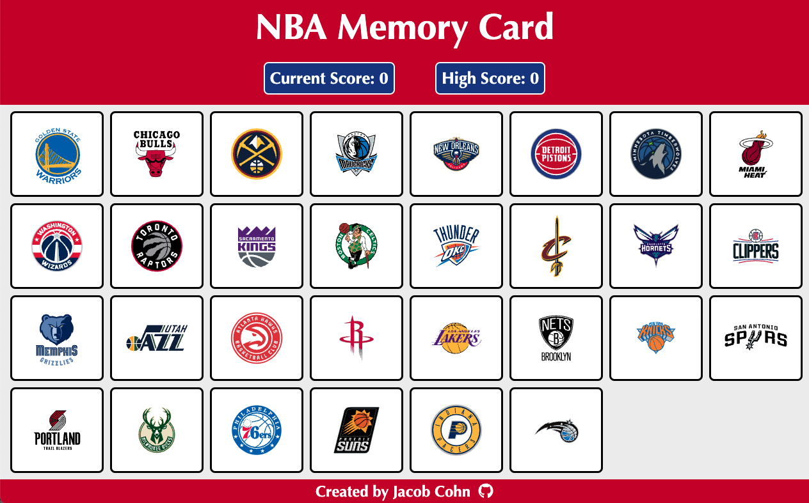

# NBA Memory Card

A React memory card game where players try to click each NBA team only once while the cards shuffle after every selection.

## Preview

## Where To Play

> **Live Preview:** https://jacobcohn.github.io/nba-memory-card/

You can play on a computer, tablet, or phone. Just open a browser and go to the link above.

## How To Play

Click an NBA team to earn a point. After every click, the teams shuffle. If you click the same team twice, your score resets to 0.

Try to get the highest score possible. Good luck!

## Features

- NBA-themed memory card gameplay
- Cards shuffle after every click
- Score tracking
- Responsive design for desktop, tablet, and mobile

## Technologies Used

- React
- React Icons
- React Testing Library
- Styled Components
- UUID

## Credit

NBA team names and imagery are used for educational and non-commercial purposes.
